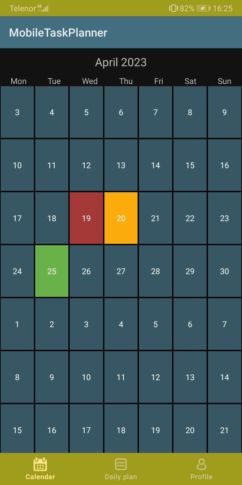
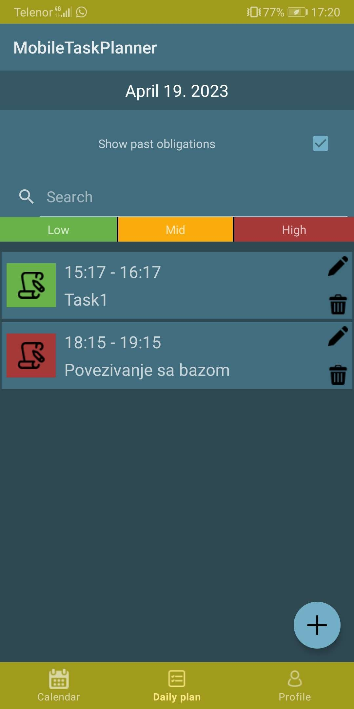
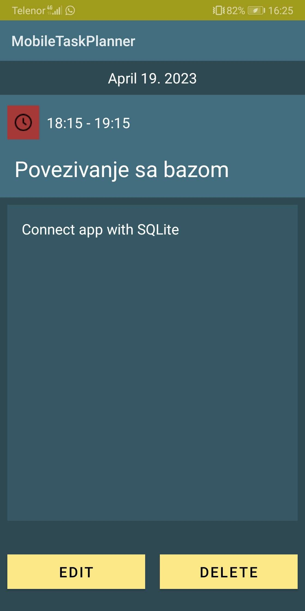
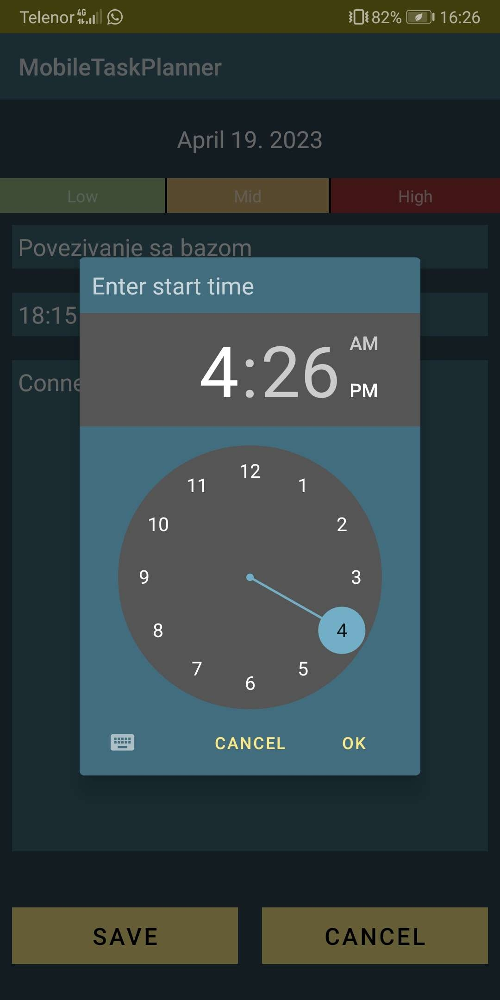

# Mobile task planner

This is a simple task planner for mobile devices. It is written in Java and uses the [Android SDK](http://developer.android.com/sdk/index.html) to run on Android devices.

## Calendar

The calendar is a simple calendar that allows you to add tasks to a specific date. The tasks are stored in a SQLite database. On the calendar you can see the importance of the most important task for every day.

| Calendar  | Daily tasks |
| ------------- | ------------- |
|   |   |

## Task list

For every date there is a list of tasks reserved for that date. The tasks are stored in a SQLite database.
Every task has a title, starting and beggining time, priority, status, a

### Task filters

The to-do list allows you to filter the tasks by priority, status, and due date.

| Task View  | Creating a new task |
| ------------- | ------------- |
|   |   |

## Languages and themes

App supports Dark/Light themes and English/Serbian languages.

## Implementation

SQLite, ViewModel, LiveData, RecyclerView, Fragments, ViewPager, ViewPager2, BottomNavigationView.